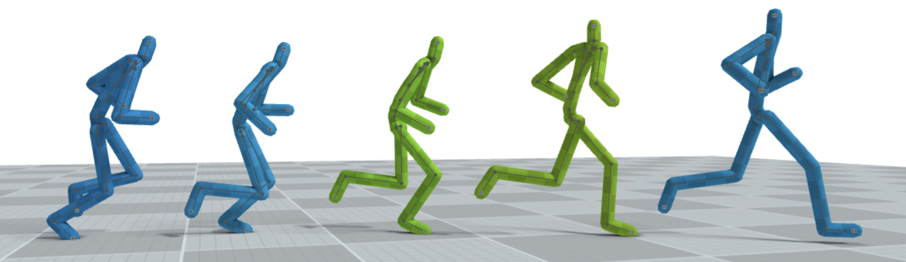

# Motion-In-betweening

This repository contains the code for a 6-ECTS individual project as part of the [DD2465 Advanced, Individual Course in Computer Science](https://www.kth.se/student/kurser/kurs/DD2465?l=en) at KTH. The project was supervised by Rajmund Nagy, a third-year PhD student at KTH. You can find the final report [here](media_readme/Report_inbetweening_Silvia_Arellano_Garcia.pdf).

### Project Overview 🚶‍♀️
The goal of this project was to develop a model capable of generating missing frames in a motion sequence, with variable gap sizes up to a maximum of 15 frames. Our model generates joint rotations and root positions separately:
1. **Joint rotations** using a diffusion model with a UNet architecture and Conv1D layers, conditioned on the reference frames' angles.
2. **Root positions** using an LSTM, conditioned on the root positions of the reference frames and the bone lengths.

Our approach produces smooth and realistic motion across a variety of actions.

### Motivation 🤩
This project aimed to:
- Gain hands-on experience implementing a diffusion model from scratch.
- Work with complex spatial and temporal data.
- Contribute to accelerating animation editing processes.

### Objectives 💡
The key objectives were:
- Implement a deep-learning-based approach for motion in-betweening.
- Evaluate the model's performance qualitatively and quantitatively against baselines and related works.

### Results 👀
Some examples comparing the motion generated by our model (15 missing central frames) with the original motion:

### How to Run
⚠️ This part will be updated soon! ⚠️
